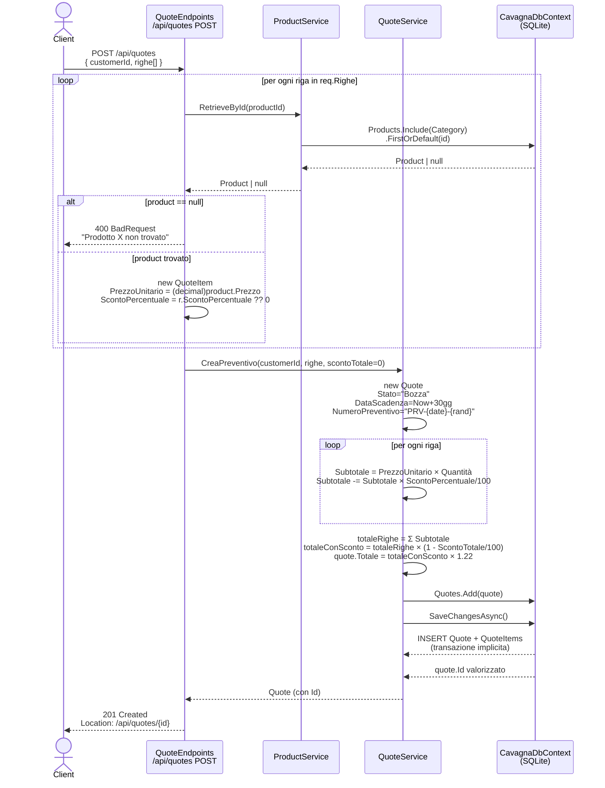
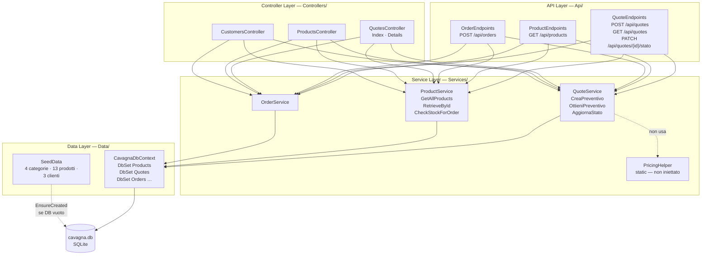

# Diagrammi — Flusso creazione preventivo

## Sequence Diagram — POST /api/quotes

```mermaid
sequenceDiagram
    actor Client
    participant EP as QuoteEndpoints<br/>/api/quotes POST
    participant PS as ProductService
    participant QS as QuoteService
    participant DB as CavagnaDbContext<br/>(SQLite)

    Client->>EP: POST /api/quotes<br/>{ customerId, righe[] }

    loop per ogni riga in req.Righe
        EP->>PS: RetrieveById(productId)
        PS->>DB: Products.Include(Category)<br/>.FirstOrDefault(id)
        DB-->>PS: Product | null
        PS-->>EP: Product | null
        alt product == null
            EP-->>Client: 400 BadRequest<br/>"Prodotto X non trovato"
        else product trovato
            EP->>EP: new QuoteItem<br/>PrezzoUnitario = (decimal)product.Prezzo<br/>ScontoPercentuale = r.ScontoPercentuale ?? 0
        end
    end

    EP->>QS: CreaPreventivo(customerId, righe, scontoTotale=0)

    QS->>QS: new Quote<br/>Stato="Bozza"<br/>DataScadenza=Now+30gg<br/>NumeroPreventivo="PRV-{date}-{rand}"

    loop per ogni riga
        QS->>QS: Subtotale = PrezzoUnitario × Quantità<br/>Subtotale -= Subtotale × ScontoPercentuale/100
    end

    QS->>QS: totaleRighe = Σ Subtotale<br/>totaleConSconto = totaleRighe × (1 - ScontoTotale/100)<br/>quote.Totale = totaleConSconto × 1.22

    QS->>DB: Quotes.Add(quote)
    QS->>DB: SaveChangesAsync()
    DB-->>QS: INSERT Quote + QuoteItems<br/>(transazione implicita)
    DB-->>QS: quote.Id valorizzato

    QS-->>EP: Quote (con Id)
    EP-->>Client: 201 Created<br/>Location: /api/quotes/{id}
```

---

## Flowchart — Layer dell'applicazione

```mermaid
flowchart TD
    subgraph API["API Layer — Api/"]
        A1["QuoteEndpoints\n POST /api/quotes\n GET /api/quotes\n PATCH /api/quotes/{id}/stato"]
        A2["ProductEndpoints\n GET /api/products"]
        A3["OrderEndpoints\n POST /api/orders"]
    end

    subgraph MVC["Controller Layer — Controllers/"]
        C1["QuotesController\n Index · Details"]
        C2["ProductsController"]
        C3["CustomersController"]
    end

    subgraph SVC["Service Layer — Services/"]
        S1["QuoteService\n CreaPreventivo\n OttieniPreventivo\n AggiornaStato"]
        S2["ProductService\n GetAllProducts\n RetrieveById\n CheckStockForOrder"]
        S3["OrderService"]
        SH["PricingHelper\n static — non iniettato"]
    end

    subgraph DATA["Data Layer — Data/"]
        D1["CavagnaDbContext\n DbSet Products\n DbSet Quotes\n DbSet Orders …"]
        D2["SeedData\n 4 categorie · 13 prodotti · 3 clienti"]
    end

    DB[("cavagna.db\nSQLite")]

    A1 & A2 & A3 --> S1 & S2 & S3
    C1 & C2 & C3 --> S1 & S2 & S3
    S1 & S2 & S3 --> D1
    S1 -.->|"non usa"| SH
    D1 --> DB
    D2 -.->|"EnsureCreated\nse DB vuoto"| DB
```
